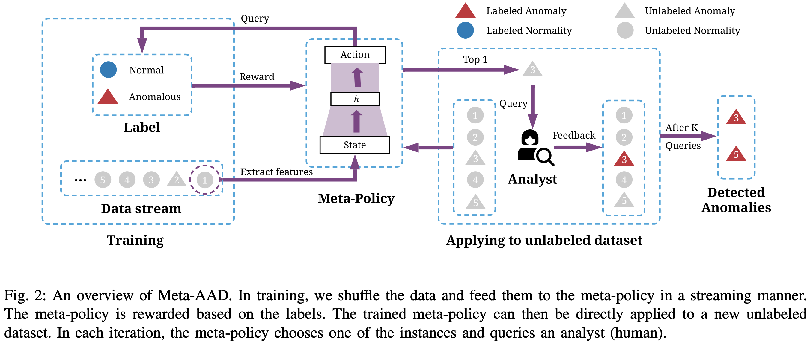

# [ICDM 2020] Meta-AAD: Active Anomaly Detection with Deep Reinforcement Learning

This is the implementation of ICDM 2020 paper [Meta-AAD: Active Anomaly Detection with Deep Reinforcement Learning](https://arxiv.org/abs/2009.07415). We propose to learn a meta-policy with deep reinforcement learning to optimize the performance of active anomaly detection. Please refer the paper for more deteails.


## Cite this Work
If you find this project helpful, for now, please cite

```bibtex
@inproceedings{DBLP:conf/icdm/ZhaLWH20,
  author    = {Daochen Zha and
               Kwei{-}Herng Lai and
               Mingyang Wan and
               Xia Hu},
  editor    = {Claudia Plant and
               Haixun Wang and
               Alfredo Cuzzocrea and
               Carlo Zaniolo and
               Xindong Wu},
  title     = {Meta-AAD: Active Anomaly Detection with Deep Reinforcement Learning},
  booktitle = {20th {IEEE} International Conference on Data Mining, {ICDM} 2020,
               Sorrento, Italy, November 17-20, 2020},
  pages     = {771--780},
  publisher = {{IEEE}},
  year      = {2020},
  url       = {https://doi.org/10.1109/ICDM50108.2020.00086},
  doi       = {10.1109/ICDM50108.2020.00086},
  timestamp = {Wed, 17 Feb 2021 11:24:58 +0100},
  biburl    = {https://dblp.org/rec/conf/icdm/ZhaLWH20.bib},
  bibsource = {dblp computer science bibliography, https://dblp.org}
}
```

## Installation
Make sure you have **python 3.5+** installed.
```
git clone https://github.com/daochenzha/Meta-AAD.git
cd Meta-AAD
pip install -r requirments.txt
pip install -e .
```

## Training a Meta-Policy
Train a meta-policy with `train.py`. The important arguments are as follows.

*   `--train`: the datasets used for training, seperated by commas.
*   `--test`: the datasets used for testing, seperated by commas.
*   `--num_timesteps`: the number of training steps of reinforcement learning agents
*   `--log`: where the log and models will be outputted

By default, the reinforcement learning training log will be saved in `log/`, the anomaly discovery curves will be saved in `log/anomaly_curves`, and the trained model will be saved in `log/`.

## Evaluating a Trained Model
You may evaluate a trained model with `evaluate.py`. The important arguments are as follows.

*   `--load`: the path to `model.zip` file.
*   `--test`: the datasets used for testing, seperated by commas.

## Baselines
We provide two baselines in this repo for comparison: a random query strategy and IForest query strategy. They are available in `evaluate_baselines.py`. For other baselines, please refer to the following repos.

*   *AAD*: [https://github.com/shubhomoydas/ad_examples](https://github.com/shubhomoydas/ad_examples)
*   *FIF*: [https://github.com/siddiqmd/FeedbackIsolationForest](https://github.com/siddiqmd/FeedbackIsolationForest)
*   *SSDO*: [https://github.com/Vincent-Vercruyssen/anomatools](https://github.com/Vincent-Vercruyssen/anomatools)
